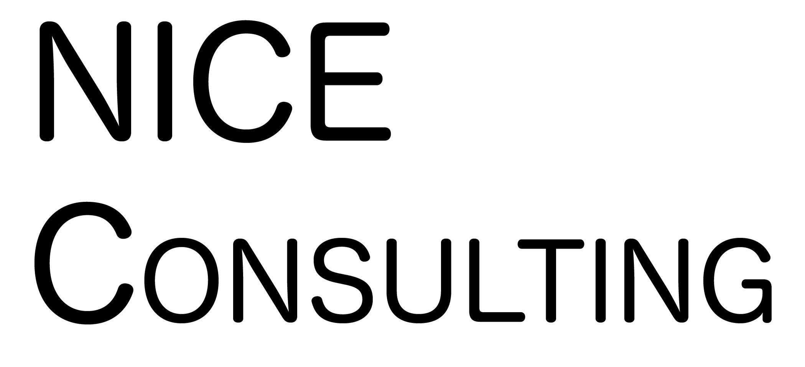

# ImageClassifierTester

This is an iOS App to test the accuracy of multiple image classifiers. This demo already includes the following classifiers.

* MobileNetV2
* Resnet50FP16
* Squeezenet
* MNIST Classifier (Digit Classifier)

The above models and more can be found under Apple's [Core ML Models](https://developer.apple.com/machine-learning/models/).

## How it works
The App works by taking photo within the app using the camera on your iOS device. Using that photo it then makes predictions via each classifier requested. It puts all the top result from each classification to display in a Table View.

For example:

As you can see, the result also includes the confidence result in percentage of each classifier.

## Adding a new model for testing.

To test a custom or new image classifier, you must implement this in Apple's mlmodel format.

Once you have your model then all you have to do is add the following statement using the new model in ImageClassifierViewController.imagePickerController(..). See the Comment for exact location.

>if let model = try? <**Your Model Class Name**>(configuration: MLModelConfiguration()).model {
>    detect(image: convertedImage, mlModel: model, classifier: <**Your classifer name as a string**>)
>}

Once you've done that then you will see your classifier's results added to the Table View.

See the following video on how it works.

<iframe width="560" height="315" src="https://www.youtube.com/embed/5N9tpXq86Ro" frameborder="0" allow="accelerometer; autoplay; clipboard-write; encrypted-media; gyroscope; picture-in-picture" allowfullscreen></iframe>
